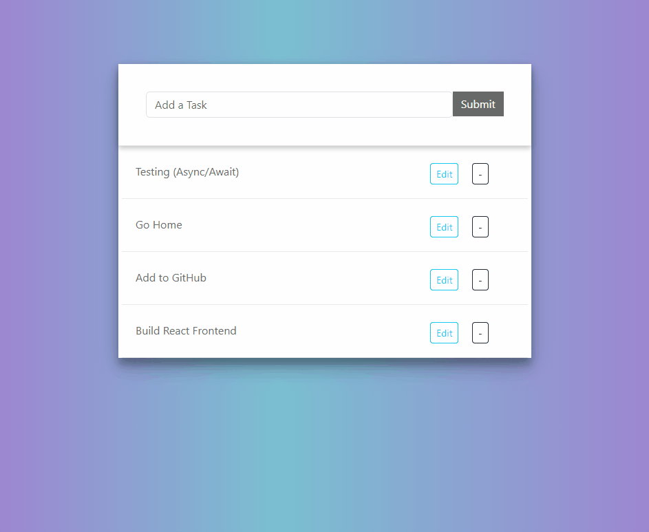

# django-rest-framework-todo-app

This is a Todo List app built using React for the frontend and Django with the Django Rest Framework (DRF) for the backend. The app allows users to manage their tasks by adding, editing, marking as completed, and deleting tasks.



## Table of Contents

- [Description](#description)
- [Features](#features)
- [Installation](#installation)
- [Usage](#usage)
- [Contributing](#contributing)
- [License](#license)

## Description

This To-Do App is a web-based application that allows users to create, edit, and delete tasks. The frontend is built using React, HTML,and CSS (styled with Bootstrap). The backend is powered by Django and Django REST Framework, Python web frameworks. The app utilizes AJAX with the Fetch API to provide a seamless user experience by dynamically updating the task list without requiring a full page refresh.

## Features

- Create new tasks with a title.
- Edit existing tasks.
- Mark tasks as completed or incomplete with a strike-through.
- Delete tasks.
- Stylish and responsive interface.
- Utilizes Django's CSRF protection for security.
- Fetches task data using AJAX to the api endpoint for real-time updates.

## Installation

1. Clone this repository to your local machine:
   ```bash
   git clone https://github.com/your-username/django-todo-app.git
    ```
2. Navigate to the project directory
   ```bash
    cd django-todo-app
    ```
3. Create and activate a virtual environment (optional but recommended):
   ```bash
   python3 -m venv venv
   source venv/bin/activate
    ```
4. Install the project dependencies using pip:
   ```bash
    pip instll -r requirements.txt
    ```
5. Apply the database migrations:
   ```bash
    python manage.py migrate
    ```
6. Install node.js and npm (Node Package Manager)
7. Navigate to the frontend directory
    ```bash
   cd frontend 
   ```
8. Install frontend dependencies using npm:
    ```bash
   npm install
   ```
9. Build the React app:
    ```bash
   npm build
   ```
## Usage

1. Create superuser with your email account as your username (even if it's a fake email address)
   ```bash
   python manage.py createsuperuser
   ```

2. Run the development server:
   ```bash
   python manage.py runserver
   ```

3. Open your web browser and go to `http://127.0.0.1:8000` to access the To-Do app.

4. Use the interface to add, edit, complete, and delete tasks. The app will use AJAX to update the task list dynamically.

## Contributing
Contributions are welcome! If you find any bugs or have suggestions for improvements, feel free to open an issue or submit a pull request.

## License
This project is licensed under the MIT License.
